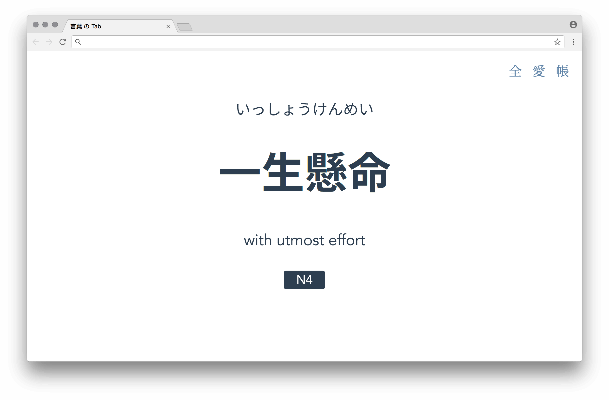
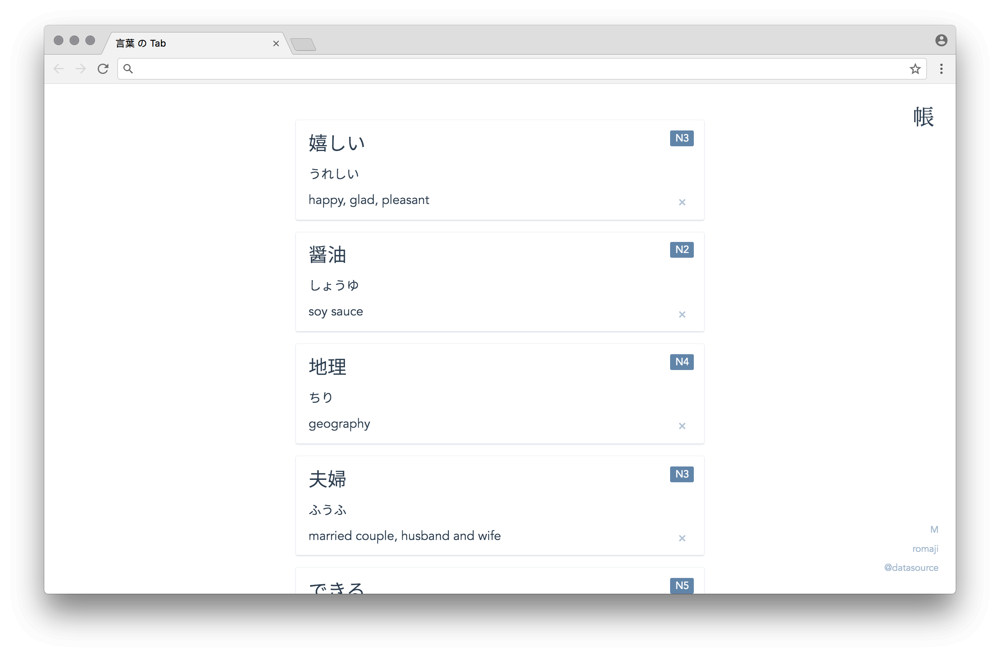
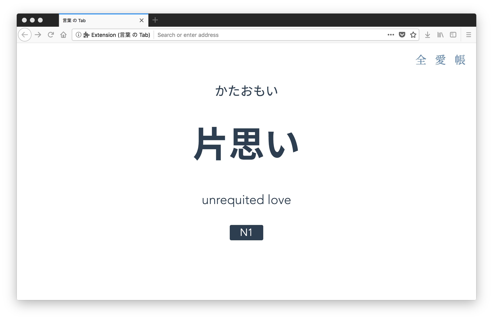
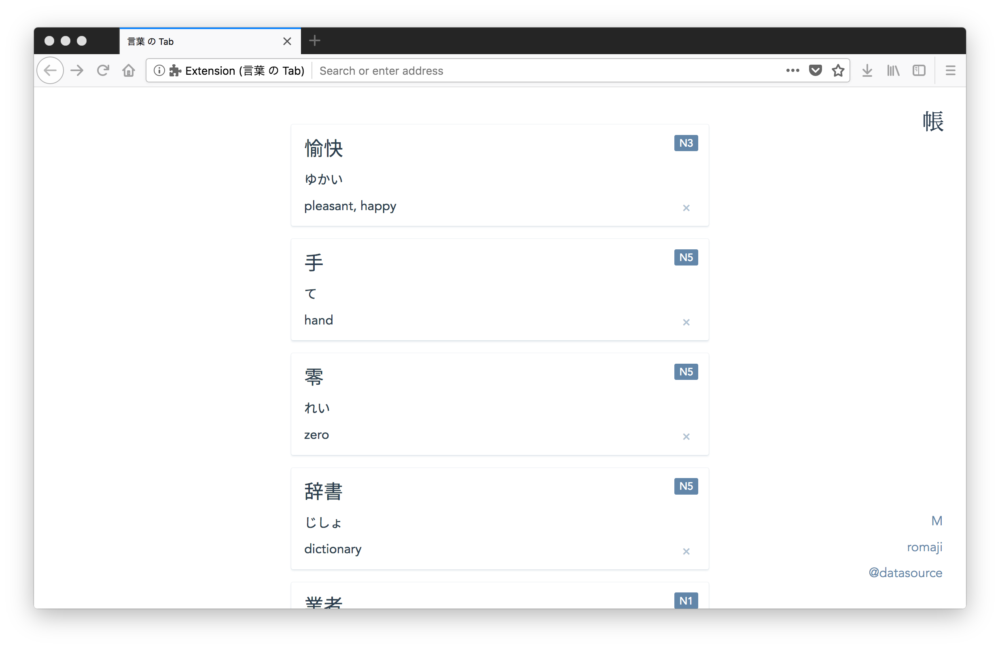

# 言葉 の Tab

A minimal Chrome / Firefox extension to help you study Japanese words in each new tab.

## [Chrome Web Store](https://chrome.google.com/webstore/detail/%E8%A8%80%E8%91%89-%E3%81%AE-tab/lacmiiahoideajihiclkhmdkikkbjcnb)

## [Firefox Add-ons](https://addons.mozilla.org/en-US/firefox/addon/the-tab-of-words/?src=https://the-tab-of-words.keipixel.com/)

## Release Notes

- `1.0.0` First launch
- `1.1.0` Added Chrome Sync
- `1.2.0` Added font size setting
- `1.2.1` Supported Firefox
