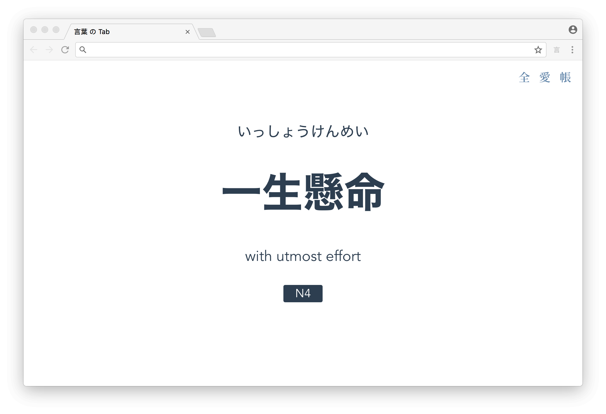
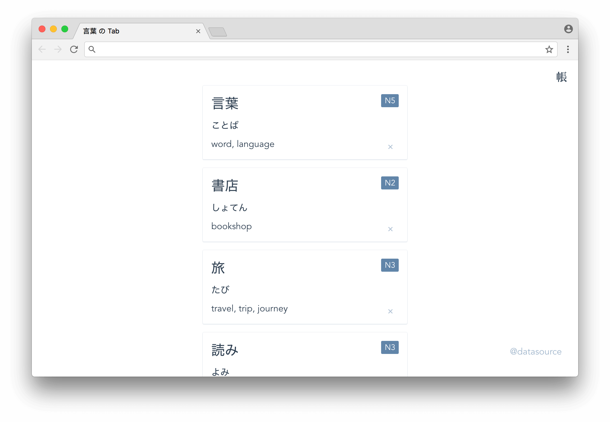

# 言葉 の Tab

A minimal Chrome extension to help you study Japanese words in each new tab.

## [Download](https://github.com/keiww/the-tab-of-words/raw/master/the-tab-of-words.crx)

## Installation

- Open `chrome://extensions/` in Chrome
- Drag `the-tab-of-words.crx` to Chrome
